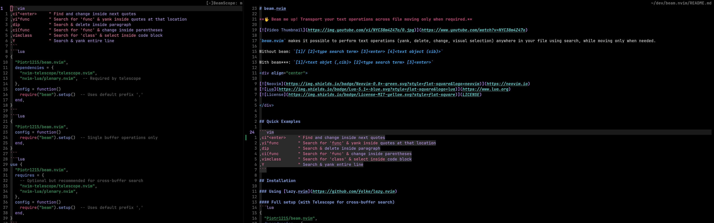

# beam.nvim

**🖖 Beam me up! Transport your text operations across file moving only when required.**

[](https://www.youtube.com/watch?v=NYC38m4Z47o)

`beam.nvim` makes it possible to perform text operations (yank, delete, change, visual selection) anywhere in your file using search, while moving only when needed.

Without beam: `[1]/ [2]<type search term> [3]<enter> [4]<text object (cib)>`

With beam-->: `[1]/<text object (,cib)> [2]<type search term> [3]<enter>`

Or easier if you know that next object to change is right below.

`[1]<text object (,cim)> [2]<enter>`

<div align="center">

[](https://neovim.io)
[](https://www.lua.org)
[](LICENSE)

</div>

* [Quick Examples](#quick-examples)
* [Installation](#installation)
* [Features](#features)
* [Usage](#usage)
* [Configuration](#configuration)
* [Troubleshooting](#troubleshooting)
* [Inspiration](#inspiration)
* [License](#license)

## Quick Examples

```vim
,ci"<enter>     " Find and change inside next quotes
,yi"func        " Search for 'func' & yank inside quotes at that location
,dip            " Search & delete inside paragraph
,ci(func        " Search for 'func' & change inside parentheses
,vimclass       " Search for 'class' & select inside code block
,Y              " Search & yank entire line
,cifconst       " Find 'const' & change function body
,di"error       " Find 'error' string & delete it
,yapfunction    " Find 'function' & yank paragraph
,vi{className   " Find 'className' & select code block
```

> [!NOTE]
> **BeamScope in action**: This screenshot shows BeamScope's visual text object selection interface. When you trigger an operation like `,ci"`, BeamScope displays all available quote pairs in a side window, starting from your cursor position. You can navigate with `j`/`k`, filter with `/`, and select with `Enter` - making it easy to target exactly the text object you want without searching.

 

## Installation

### Using [lazy.nvim](https://github.com/folke/lazy.nvim)

#### Full setup (with Telescope for cross-buffer search)
```lua
{
  "Piotr1215/beam.nvim",
  dependencies = {
    "nvim-telescope/telescope.nvim",
    "nvim-lua/plenary.nvim",  -- Required by telescope
  },
  config = function()
    require("beam").setup()  -- Uses default prefix ','
  end,
}
```

#### Minimal setup (without cross-buffer search)
```lua
{
  "Piotr1215/beam.nvim",
  config = function()
    require("beam").setup()  -- Single buffer operations only
  end,
}
```

### Using [packer.nvim](https://github.com/wbthomason/packer.nvim)

```lua
use {
  "Piotr1215/beam.nvim",
  requires = {
    -- Optional but recommended for cross-buffer search
    "nvim-telescope/telescope.nvim",
    "nvim-lua/plenary.nvim",
  },
  config = function()
    require("beam").setup()  -- Uses default prefix ','
  end,
}
```

**Note:** The plugin uses `,` as the default prefix. All mappings like `,yi"`, `,dap`, etc. are automatically created. You can customize the prefix in the setup (see Configuration section).

## Features

These features are considered _stable_ and the settings and interface should remain backwards compatible  in the new plugin versions.

- **Native Search Integration** - Uses Vim's `/` search with incremental highlighting
- **BeamScope** - Visual text object selection interface with smart cursor positioning
- **Standard Text Object Support** - Supports all [nvim standard text objects](https://neovim.io/doc/user/vimindex.html#_2.1-text-objects)
- **Custom Text Objects** - Define your own text objects with full implementation
- **Auto-Discovery** - Finds and uses text objects from your plugins automatically
- **Conflict Resolution** - Smart handling of text object collisions between plugins
- **Exclusion Control** - Fine-grained control over which text objects to use
- **Visual Feedback** - Shows selection briefly before operation executes
- **Smart Position Restore** - Yank/delete returns to origin, change/visual stays at target
- **Search Navigation** - Use `Ctrl-G`/`Ctrl-T` to navigate matches while searching
- **Line Operators** - Special `Y`, `D`, `C`, `V` operators for entire lines
- **Statusline Integration** - See pending operations in your statusline

### Experimental Features

These features are considered experimental and might be changed or removed in the future released on the plugin.

- **Telescope Integration** - Optional fuzzy finder for powerful cross-buffer search
- **Cross-Buffer Operations** - Search and operate across all open buffers

## Usage

### How it Works

1. Press `,yi"` (or any operator + text object)
2. Search for your target location (or BeamScope selection appears for scoped objects)
3. Press Enter
4. Operation executes there, cursor returns (for yank/delete)

### When BeamScope vs Search Activates

- **BeamScope**: Automatically activates for scoped text objects (quotes, brackets, tags) when multiple instances exist in the buffer. Shows all instances in a side window for visual selection.
- **Regular Search**: Used for all other text objects (words, paragraphs, sentences) or when BeamScope is disabled. Uses Vim's native `/` search with incremental highlighting.

### Common Operations

| Keys | Action | Example Use Case | Cursor Behavior |
|------|--------|------------------|-----------------|
| `,yi"` | Yank inside quotes | Copy string without moving | Returns to origin |
| `,ya(` | Yank around parentheses | Copy function call with parens | Returns to origin |
| `,dip` | Delete inside paragraph | Remove paragraph content | Returns to origin |
| `,dap` | Delete around paragraph | Remove entire paragraph + spacing | Returns to origin |
| `,ciw` | Change inside word | Replace word under search | Stays at target |
| `,ci"` | Change inside quotes | Edit string content | Stays at target |
| `,vi{` | Select inside braces | Highlight code block | Stays at target |
| `,vit` | Select inside HTML tag | Select tag content | Stays at target |
| `,Y` | Yank entire line | Copy full line at search | Returns to origin |
| `,C` | Change entire line | Replace line at search | Stays at target |

### Search Navigation

While searching:
- `Ctrl-G` - Next match
- `Ctrl-T` - Previous match  
- `Enter` - Execute
- `Esc` - Cancel

### Supported Text Objects

beam.nvim works with ALL [Vim/Neovim text objects](https://neovim.io/doc/user/vimindex.html#_2.1-text-objects):
- **Basic**: `iw`/`aw` (word), `is`/`as` (sentence), `ip`/`ap` (paragraph)
- **Quotes**: `i"`/`a"`, `i'`/`a'`, `` i` ``/`` a` ``
- **Brackets**: `i(`/`a(`, `i[`/`a[`, `i{`/`a{`, `i<`/`a<`
- **Tags**: `it`/`at` (HTML/XML)
- **Line operators**:
`Y`, `D`, `C`, `V` for entire lines

> [!TIP]
> Run `:BeamShowTextObjects` to see all available text objects including those from other plugins.

With auto-discovery enabled, beam automatically integrates text objects from
When `auto_discover_text_objects = true`, beam automatically finds and uses text objects from:
- **treesitter-textobjects**: `if` (function), `ic` (class), `il` (loop), etc.
- [mini.ai](https://github.com/echasnovski/mini.ai):  Custom text objects you've defined
- **nvim-various-textobjs**: `ii` (indentation), `R` (rest of line), etc.
- **targets.vim**: Seek-able text objects with next/last variants
- Any other plugin that defines text objects!

### Commands

| Command | Description |
|---------|-------------|
| `:BeamReload` | Reload the plugin configuration |
| `:BeamDiscoverNow` | Manually trigger text object discovery |
| `:BeamShowTextObjects` | Display all discovered text objects |

## Configuration

### Practical Setup

```lua
-- Most users will want something like this:
require('beam').setup({
  prefix = ',',                      -- Your prefix key
  beam_scope = { enabled = true },   -- Visual selection for quotes/brackets
  auto_discover_custom_text_objects = true, -- Use text objects from other plugins
})
```

### Telescope Integration (Experimental)

When `cross_buffer.enabled = true` and you have [Telescope](https://github.com/nvim-telescope/telescope.nvim) installed, beam uses it for fuzzy finding across buffers.

- Multiple buffers → Telescope automatically activates
- Single buffer → Native `/` search (unless `experimental.telescope_single_buffer.enabled = true`)
- `include_hidden = false` → Only searches visible buffers (recommended)

### Auto-Discovery

With `auto_discover_custom_text_objects = true` (default), beam automatically finds text objects from:
- **mini.ai** - arguments, function calls, custom patterns
- **treesitter-textobjects** - functions, classes, loops
- **nvim-various-textobjs** - URLs, indentation, headers
- Any plugin that defines text objects

### BeamScope (Visual Text Object Selection)

BeamScope provides a visual interface for selecting text objects when multiple instances exist in a buffer. Instead of searching, it shows all instances and lets you pick one.

When enabled (default), BeamScope automatically activates for delimited text objects like quotes and brackets. It displays all instances in a side window where you can:
- Navigate with `j`/`k` or `Ctrl-n`/`Ctrl-p`
- Search to filter with `/`
- Select with `Enter`
- Cancel with `Esc` or `q`

#### Smart Cursor Positioning

BeamScope intelligently positions the buffer view based on your cursor location:
- **Primary behavior**: Shows the text object instance at or just below your cursor position
- **Fallback**: If no instances exist below the cursor, shows the nearest one above
- **Benefit**: No need to scroll through the entire buffer - BeamScope starts right where you're working

This means when you trigger BeamScope, you immediately see the most relevant text objects near your current position, making selection faster and more intuitive.

**Note**: BeamScope is incompatible with cross-buffer operations. When `cross_buffer.enabled = true`, BeamScope is automatically disabled.

### Smart Highlighting

When `smart_highlighting = true`, search highlights only appear within the text object context. For example, `,di"` → `/test` only highlights "test" inside quotes, not everywhere. Works with native search only (not Telescope).


### Statusline Integration

Add the pending operation indicator to your statusline:


```lua
-- Lualine
sections = {
  lualine_x = {
    function() return vim.g.beam_search_operator_indicator or '' end
  }
}

-- Native statusline
vim.opt.statusline:append('%{get(g:,"beam_search_operator_indicator","")}')
```


<details>
<summary>Full configuration options</summary>

```lua
require('beam').setup({
  -- Core settings
  prefix = ',',                      -- Prefix for all mappings
  
  -- Visual feedback
  visual_feedback_duration = 150,    -- Duration to show selection before operation
  clear_highlight = true,            -- Clear search highlight after operation
  clear_highlight_delay = 500,       -- Delay before clearing highlight
  
  -- Cross-buffer operations with Telescope
  cross_buffer = {
    enabled = false,                 -- Enable cross-buffer operations
    fuzzy_finder = 'telescope',      -- Fuzzy finder to use (currently only telescope)
    include_hidden = false,          -- Include hidden buffers in search (default: only visible)
  },
  
  -- BeamScope visual selection
  beam_scope = {
    enabled = true,                  -- Enable BeamScope for visual text object selection
    scoped_text_objects = {          -- Text objects that trigger BeamScope
      '"', "'", '`',                 -- Quotes
      '(', ')', '[', ']', '{', '}',  -- Brackets
      '<', '>', 'b', 'B', 't'        -- Angles, aliases, tags
    },
    custom_scoped_text_objects = {}, -- Additional custom text objects for BeamScope
    preview_context = 3,             -- Lines of context in preview
    window_width = 80,               -- Maximum width of BeamScope window
  },
  
  -- Text object configuration
  enable_default_text_objects = true, -- Enable beam's custom text objects (im/am for markdown code blocks)
  auto_discover_custom_text_objects = true, -- Discover custom text objects from plugins (mini.ai, treesitter, etc.)
  show_discovery_notification = true,-- Notify about discovered objects
  excluded_text_objects = {},       -- List of text object keys to exclude (e.g., {'q', 'z'})
  excluded_motions = {},             -- List of motion keys to exclude (e.g., {'Q', 'R'})
  resolved_conflicts = {},          -- Mark conflicts as intentional (e.g., {'m'})
  custom_text_objects = {},         -- Define custom text objects (key = description pairs)
  
  -- Search behavior
  smart_highlighting = false,        -- Context-aware search highlighting (native search only)
  
  -- Experimental features
  experimental = {
    telescope_single_buffer = {
      enabled = false,               -- Use Telescope for single buffer search (optional)
      theme = 'dropdown',            -- Theme: 'dropdown', 'cursor', 'ivy'
      preview = false,               -- Show preview pane
      winblend = 10                  -- Window transparency (0-100)
    },
    dot_repeat = false,              -- Enable dot repeat support (experimental)
    count_support = false            -- Enable count support (experimental)
  }
})
```

</details>


## Troubleshooting

### Quick health check
Run `:checkhealth beam` to diagnose common issues.

### Mappings not working?
- Check if your prefix key is already mapped: `:verbose nmap <prefix>` (where `<prefix>` is your configured prefix, default is `,`)
- Ensure the plugin is loaded: `:lua print(vim.g.loaded_beam)`
- Verify your configuration: `:lua print(vim.inspect(require('beam').get_config()))`

### Operations not executing?
- Make sure you have the text objects installed that you're trying to use
- Check `:messages` for any error output

## Inspiration

Inspired by the power of Vim's composable operations and the desire to operate on text without losing context as well as several excellent Neovim plugins that explore innovative ways of navigating and manipulating text:

- [flash.nvim](https://github.com/folke/flash.nvim) - Jump to any location with minimal keystrokes
- [leap.nvim](https://github.com/ggandor/leap.nvim) - General-purpose motion plugin with 2-character search
- [hop.nvim](https://github.com/phaazon/hop.nvim) - Neovim motions on speed
- [vim-sneak](https://github.com/justinmk/vim-sneak) - The missing motion for Vim

While these plugins focus on cursor movement, beam.nvim takes a different approach: **operate on remote text, moving only when it makes sense** - stay in place for yank and delete, jump to location for change and visual selection.

## License

MIT 

---

<div align="center">

[Report Bug](https://github.com/Piotr1215/beam.nvim/issues) · [Request Feature](https://github.com/Piotr1215/beam.nvim/issues)

</div>
